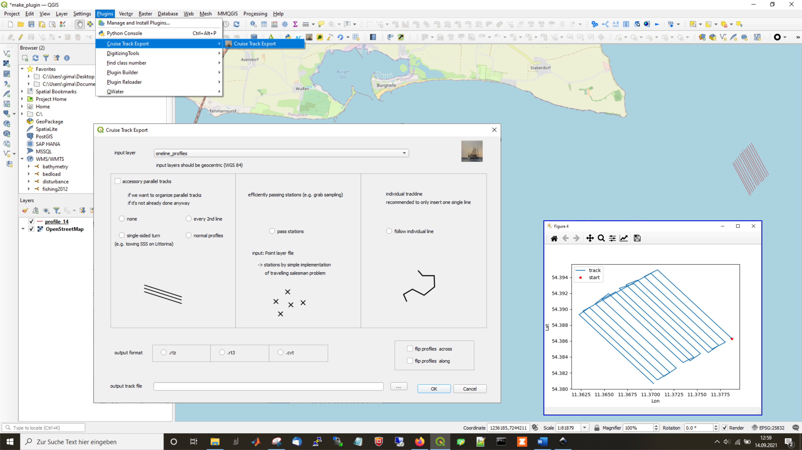
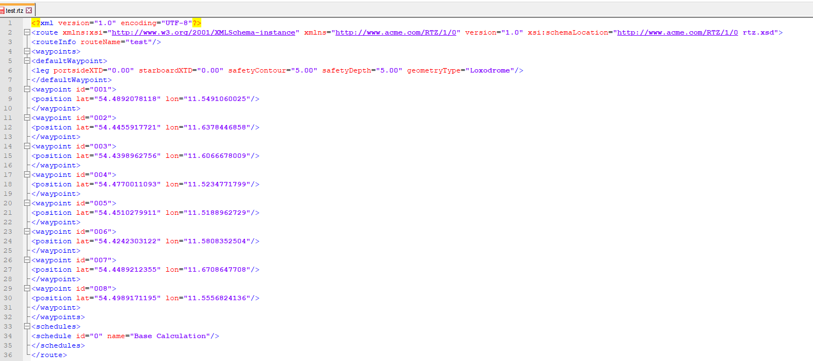

# cruisetrackexport

QGIS Plugin that helps exporting navigation files for Transas Ecdis. The order of waypoints can simply be sorted in a preferred way.

Export to the following file formats:
- rtz
- rt3
- cvt-files.

Build by utilizing QGIS Plugin Builder.

Any tips, help, tests are welcome. :)

## Installation

### Ubuntu 

```bash
git clone https://github.com/gim4p/cruise_track_tool.git
ln -s cruise_track_tool/cruisetrack/ ~/.local/share/QGIS/QGIS3/profiles/default/python/plugins
```

### Windows

#### with zip

Just download the folders directly. Simply rezip the "cruise_track" folder which is located in the main folder "cruise_track_tool-main". You can then use this re-zipped folder to install the tool via the "Install from ZIP" option in the Plugin Installer.

#### with symlink

[see instructions here](https://www.howtogeek.com/howto/16226/complete-guide-to-symbolic-links-symlinks-on-windows-or-linux/)

```shell
git clone https://github.com/gim4p/cruise_track_tool.git
mklink /J "cruise_track_tool\cruise_track" "QGIS\QGIS3\profiles\default\python\plugins"
```

## Examples

### Gui




### rtz output file:




